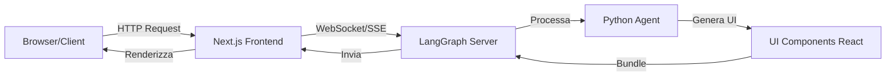

# Guida Didattica: Generative UI con LangGraph

## 📚 Indice

1. [Cos'è questo progetto?](#cosè-questo-progetto)
2. [Architettura del Sistema](#architettura-del-sistema)
3. [LangGraph: Il Cervello del Sistema](#langgraph-il-cervello-del-sistema)
4. [React e Next.js: L'Interfaccia Utente](#react-e-nextjs-linterfaccia-utente)
5. [Il Flusso Completo dei Dati](#il-flusso-completo-dei-dati)
6. [Generative UI: Cosa Significa?](#generative-ui-cosa-significa)
7. [Struttura del Progetto](#struttura-del-progetto)
8. [Come Funziona la LangGraph CLI](#come-funziona-la-langgraph-cli)

---

## Cos'è questo progetto?

Questo è un progetto dimostrativo che mostra come creare un'**interfaccia utente generativa** (Generative UI) utilizzando:
- **Python** con **LangGraph** per la logica dell'agente AI
- **React** con **Next.js** per l'interfaccia utente
- **OpenAI GPT** per l'intelligenza artificiale

### Cosa significa "Generative UI"?

Normalmente, quando chiedi qualcosa a un chatbot, ottieni solo **testo** come risposta. Con la Generative UI, l'AI può decidere di mostrarti **componenti visivi interattivi** invece di semplice testo.

**Esempio:**
- ❌ Risposta tradizionale: "A New York oggi ci sono 22°C con 45% di umidità"
- ✅ Generative UI: L'AI mostra una **card meteo colorata** con icone e layout professionale

> **⚠️ NOTA IMPORTANTE: Questo è un Esempio Didattico Semplificato**
> 
> Questo progetto è pensato per **scopi educativi** e usa una logica **deliberatamente semplificata**:
> - **Grafo Lineare**: L'agente esegue sempre lo stesso flusso (`start → weather → end`)
> - **Nessun Tool**: Non usa LangChain tools o decisioni dinamiche
> - **Dati Mock**: I valori meteo (22°C, 45%) sono fissi, non chiamiamo API reali
> 
> In un'**applicazione reale** avresti:
> - ✅ Tools per chiamare API meteo vere (OpenWeatherMap, Weather API, ecc.)
> - ✅ Logica condizionale (l'AI decide quale componente mostrare)
> - ✅ Grafi multi-nodo con routing dinamico
> - ✅ Gestione errori e fallback
> 
> **Obiettivo**: Capire l'architettura e il flusso dati, non implementare un servizio meteo production-ready!

---

## Architettura del Sistema

Il progetto è diviso in **tre parti principali**:



### 1. **Backend Python** (`src/agent.py`)
- Contiene la logica dell'agente AI
- Decide **cosa** mostrare all'utente
- Usa LangGraph per gestire lo stato e il flusso
- Comunica con OpenAI per l'intelligenza

### 2. **UI Components React** (`src/agente/ui.tsx`)
- Definisce **come** visualizzare i dati
- Componenti React riutilizzabili
- Vengono "compilati" e serviti dal server LangGraph

### 3. **Client Next.js** (`src/app/page.tsx`)
- Interfaccia che l'utente vede nel browser
- Gestisce la chat e il rendering dei componenti
- Si connette al server LangGraph

---

## LangGraph: Il Cervello del Sistema

LangGraph è un framework Python per costruire agenti AI con **grafi di stato**.

### Concetti Base

#### 1. **Graph**: Il Flusso di Lavoro
Un grafo definisce i "passi" che l'agente deve seguire:

```python
workflow = StateGraph(AgentState)
workflow.add_node("weather", weather)  # Aggiungi un nodo
workflow.add_edge("__start__", "weather")  # Collega i nodi
graph = workflow.compile()  # Compila il grafo
```

**Spiegazione:**
- `StateGraph`: Crea un nuovo grafo che gestisce lo stato
- `add_node`: Aggiunge una "stazione di lavoro" (funzione Python)
- `add_edge`: Dice al grafo quale funzione eseguire dopo
- `compile()`: Prepara il grafo per l'esecuzione

#### 2. **State**: La Memoria dell'Agente
Lo state è come la "memoria" dell'agente. Contiene tutto ciò che l'agente sa:

```python
class AgentState(TypedDict):
    messages: Annotated[Sequence[BaseMessage], add_messages]
    ui: Annotated[Sequence[AnyUIMessage], ui_message_reducer]
```

**Spiegazione:**
- `messages`: La cronologia della conversazione
- `ui`: I componenti UI da mostrare
- `add_messages`: Una funzione "reducer" che accumula i messaggi
- `ui_message_reducer`: Gestisce l'aggiunta/rimozione di componenti UI

#### 3. **Node**: Le Funzioni di Lavoro
Ogni nodo è una funzione Python che:
1. Riceve lo state corrente
2. Fa qualcosa (es. chiama OpenAI)
3. Ritorna un aggiornamento dello state

```python
async def weather(state: AgentState):
    # 1. Chiedi a OpenAI di estrarre la città
    weather_data = await ChatOpenAI(model="gpt-4o-mini")
        .with_structured_output(WeatherOutput)
        .ainvoke(state["messages"])
    
    # 2. Crea un messaggio di risposta
    message = AIMessage(
        id=str(uuid.uuid4()),
        content=f"Here's the weather for {weather_data['city']}"
    )
    
    # 3. ⭐ CHIAVE: Invia un componente UI
    push_ui_message("weather", weather_data, message=message)
    
    # 4. Aggiorna lo state
    return {"messages": [message]}
```

**`push_ui_message` - Il Collegamento Magico:**
- `"weather"`: Il nome del componente React da mostrare (da `ui.tsx`)
- `weather_data`: I dati da passare al componente (props)
- `message=message`: Collega l'UI al messaggio della chat

---

## React e Next.js: L'Interfaccia Utente

### Perché React?

React è una libreria JavaScript per costruire interfacce utente **componibili**.

**Concetto Base:**
```tsx
// Un componente è una funzione che ritorna HTML
function WeatherComponent(props: { city: string }) {
  return <div>Weather for {props.city}</div>
}
```

### Perché Next.js?

Next.js è un framework costruito sopra React che aggiunge:
- **Server-Side Rendering** (velocità)
- **Routing** (navigazione tra pagine)
- **API Routes** (endpoint backend)

### La Struttura Next.js

```
src/app/
├── layout.tsx    # Layout globale (header, footer, ecc.)
├── page.tsx      # Pagina principale (home)
└── globals.css   # Stili CSS globali
```

#### `layout.tsx` - Il Contenitore
```tsx
export default function RootLayout({ children }) {
  return (
    <html lang="en">
      <body>
        {children}  {/* Qui viene inserita la pagina */}
      </body>
    </html>
  )
}
```

#### `page.tsx` - La Chat
```tsx
export default function Page() {
  // 1. Connettiti al server LangGraph
  const stream = useStream({
    apiUrl: "http://localhost:2024",
    assistantId: "agent"
  })
  
  // 2. Estrai i dati
  const { messages, values, submit } = stream
  
  // 3. Renderizza
  return (
    <div>
      {messages.map(message => (
        <div>
          {message.content}
          {/* 4. ⭐ Renderizza i componenti UI */}
          {values.ui
            ?.filter(ui => ui.metadata?.message_id === message.id)
            .map(ui => (
              <LoadExternalComponent stream={stream} message={ui} />
            ))}
        </div>
      ))}
    </div>
  )
}
```

### Il Componente UI (`src/agente/ui.tsx`)

```tsx
import React from 'react'
import { CloudSun, Thermometer, Droplets, Wind } from 'lucide-react'
import './styles.css'

const WeatherComponent = (props: { city: string }) => {
  return (
    <div className="p-4 border rounded-lg shadow-md">
      <div className="flex items-center gap-2">
        <CloudSun className="w-6 h-6 text-yellow-500" />
        <h3>Weather Forecast</h3>
      </div>
      <p>Current weather for {props.city}</p>
      
      <div className="grid grid-cols-3 gap-2">
        <div className="bg-red-50 p-3 rounded-xl">
          <Thermometer className="w-5 h-5 text-red-500" />
          <div>Temp</div>
          <div>22°C</div>
        </div>
        {/* ... altri indicatori */}
      </div>
    </div>
  )
}

// ⭐ EXPORT: Mappa dei componenti disponibili
export default {
  weather: WeatherComponent,
}
```

**Cosa succede qui?**
1. `WeatherComponent` è una funzione React
2. Riceve `props` (dati) dal Python agent
3. Usa JSX (sintassi HTML dentro JavaScript)
4. Usa Tailwind CSS per lo styling (`className="..."`)
5. L'export mappa `"weather"` → `WeatherComponent`

---

## Il Flusso Completo dei Dati

Vediamo **passo per passo** cosa succede quando l'utente chiede "What's the weather in London?":

### 1. 🖱️ L'utente invia un messaggio

```tsx
// page.tsx
submit({ messages: [{ type: "human", content: "What's the weather in London?" }] })
```

### 2. 📡 Next.js invia la richiesta al server LangGraph

```
POST http://localhost:2024/threads/{thread_id}/runs/stream
Body: { messages: [...], ... }
```

### 3. 🐍 LangGraph esegue il grafo Python

```python
# agent.py - Nodo "weather"
async def weather(state: AgentState):
    # A. Chiede a OpenAI di estrarre "London"
    weather_data = await ChatOpenAI(...)
        .with_structured_output(WeatherOutput)  # { city: "London" }
        .ainvoke(state["messages"])
    
    # B. Crea il messaggio di risposta
    message = AIMessage(content="Here's the weather for London")
    
    # C. ⭐ Dice al client di mostrare il componente "weather"
    push_ui_message("weather", {"city": "London"}, message=message)
    
    return {"messages": [message]}
```

### 4. 📦 LangGraph invia i dati al client

```json
{
  "type": "values",
  "data": {
    "messages": [...],
    "ui": [
      {
        "id": "abc123",
        "name": "weather",
        "props": { "city": "London" },
        "metadata": { "message_id": "xyz789" }
      }
    ]
  }
}
```

### 5. ⚛️ React riceve e renderizza

```tsx
// page.tsx
{values.ui?.map(ui => (
  // LoadExternalComponent carica "weather" da ui.tsx
  <LoadExternalComponent 
    stream={stream}
    message={ui}  // { name: "weather", props: { city: "London" } }
  />
))}
```

### 6. 🎨 Il browser mostra il componente

```tsx
// ui.tsx - Viene chiamato con props = { city: "London" }
<WeatherComponent city="London" />
```

### 7. ✅ L'utente vede la card meteo

```
┌─────────────────────────┐
│ ☀️ Weather Forecast     │
│ Current weather for     │
│ London                  │
│                         │
│ 🌡️ Temp    💧 Humidity │
│ 22°C       45%          │
└─────────────────────────┘
```

---

## Generative UI: Cosa Significa?

### Differenza tra Chat Tradizionale e Generative UI

#### Chat Tradizionale
```
User: Mostrami 3 hotel a Roma
AI: Ecco 3 hotel a Roma:
    1. Hotel Colosseo - €120/notte - ⭐⭐⭐⭐
    2. Hotel Pantheon - €95/notte - ⭐⭐⭐
    3. Hotel Trevi - €150/notte - ⭐⭐⭐⭐⭐
```

#### Generative UI
```
User: Mostrami 3 hotel a Roma
AI: [Mostra 3 card interattive con:]
    ┌───────────────────┐  ┌───────────────────┐  ┌───────────────────┐
    │ 🏨 Hotel Colosseo│  │ 🏨 Hotel Pantheon│  │ 🏨 Hotel Trevi   │
    │ ⭐⭐⭐⭐           │  │ ⭐⭐⭐            │  │ ⭐⭐⭐⭐⭐         │
    │ €120/notte       │  │ €95/notte        │  │ €150/notte       │
    │ [Prenota] [Info] │  │ [Prenota] [Info] │  │ [Prenota] [Info] │
    └───────────────────┘  └───────────────────┘  └───────────────────┘
```

### Vantaggi

1. **Esperienza Utente Migliore**: Visualizzazione immediata e chiara
2. **Interattività**: Pulsanti, link, form direttamente nei risultati
3. **Contesto Visivo**: Immagini, grafici, mappe
4. **Riduzione Cognitive Load**: Meno testo da leggere

### Come Funziona

L'AI **decide dinamicamente** quale componente mostrare in base al contesto:

```python
# Esempio ipotetico con più componenti

async def agent_node(state: AgentState):
    user_intent = classify_intent(state["messages"])
    
    if user_intent == "weather":
        data = get_weather(...)
        push_ui_message("weather", data, ...)
    
    elif user_intent == "hotels":
        data = search_hotels(...)
        push_ui_message("hotel_list", data, ...)
    
    elif user_intent == "directions":
        data = get_route(...)
        push_ui_message("map", data, ...)
```

---

## Struttura del Progetto

```
langgraph-gen-ui/
│
├── 📁 src/
│   ├── 📁 agente/               # Componenti UI React
│   │   ├── ui.tsx              # Definizione componenti
│   │   └── styles.css          # Stili Tailwind
│   │
│   ├── 📁 app/                  # App Next.js
│   │   ├── layout.tsx          # Layout globale
│   │   ├── page.tsx            # Pagina chat
│   │   └── globals.css         # Stili globali
│   │
│   └── agent.py                # Agente LangGraph Python
│
├── 📁 .venv/                    # Ambiente virtuale Python
├── 📁 node_modules/             # Dipendenze JavaScript
├── 📁 .next/                    # Build Next.js (generato)
│
├── langgraph.json              # Config LangGraph
├── package.json                # Dipendenze Node.js
├── requirements.txt            # Dipendenze Python
├── tsconfig.json               # Config TypeScript
└── tailwind.config.ts          # Config Tailwind CSS
```

### File Chiave

#### `langgraph.json` - Configurazione
```json
{
  "python_version": "3.12",
  "graphs": {
    "agent": "./src/agent.py:graph"  // Dove trovare il grafo
  },
  "ui": {
    "agent": "./src/agente/ui.tsx"   // Dove trovare i componenti UI
  },
  "dependencies": [
    "langgraph",
    "langchain-openai",
    ...
  ]
}
```

#### `package.json` - Scripts
```json
{
  "scripts": {
    "dev": "next dev",      // Avvia Next.js in modalità sviluppo
    "build": "next build",  // Compila per produzione
    "start": "next start"   // Avvia server produzione
  }
}
```

---

## Come Funziona la LangGraph CLI

### Cos'è la CLI?

La **LangGraph CLI** (`langgraph`) è uno strumento da riga di comando che:

1. **Legge** `langgraph.json`
2. **Avvia** un server HTTP locale
3. **Compila** i tuoi componenti React
4. **Serve** l'agente Python come API
5. **Bundle** i componenti UI per il browser

### Cosa Fa `langgraph dev`?

Quando esegui `langgraph dev`, succede questo:

```
┌─────────────────────────────────────────┐
│ 1. Legge langgraph.json                │
└─────────────────────────────────────────┘
              ↓
┌─────────────────────────────────────────┐
│ 2. Valida le dipendenze Python         │
└─────────────────────────────────────────┘
              ↓
┌─────────────────────────────────────────┐
│ 3. Importa src/agent.py:graph          │
└─────────────────────────────────────────┘
              ↓
┌─────────────────────────────────────────┐
│ 4. Compila src/agente/ui.tsx           │
│    (Webpack/Vite bundling)             │
└─────────────────────────────────────────┘
              ↓
┌─────────────────────────────────────────┐
│ 5. Avvia server HTTP localhost:2024   │
│    - /threads                          │
│    - /runs                             │
│    - /ui/{namespace}/bundle.js         │
└─────────────────────────────────────────┘
              ↓
┌─────────────────────────────────────────┐
│ 6. Watch per cambiamenti ai file       │
│    (Hot reload automatico)             │
└─────────────────────────────────────────┘
```

### Endpoints Esposti

```
http://localhost:2024
├── GET  /threads                    # Lista thread
├── POST /threads                    # Crea thread
├── POST /threads/{id}/runs/stream  # Esegui agente (streaming)
├── GET  /ui/agent/bundle.js        # Bundle UI components
└── GET  /docs                       # Documentazione API
```

### Perché Serve la CLI?

Senza la CLI, dovresti:

1. ✅ Scrivere un server FastAPI/Flask manualmente
2. ✅ Configurare Webpack/Vite per compilare React
3. ✅ Implementare lo streaming con SSE/WebSocket
4. ✅ Gestire il routing e la validazione
5. ✅ Servire i file statici compilati

La CLI fa **tutto questo automaticamente**!

### Shadow DOM e Isolamento

La CLI usa la **Shadow DOM** per caricare i componenti UI:

```tsx
// Invece di:
<div>
  <WeatherComponent />  // ❌ Condivide CSS con tutta la pagina
</div>

// Fa:
<div>
  <shadow-root>
    <style>/* CSS isolato */</style>
    <WeatherComponent />  // ✅ CSS isolato
  </shadow-root>
</div>
```

**Vantaggi:**
- ✅ Non conflitti CSS tra app e componenti
- ✅ Componenti riutilizzabili in qualsiasi app
- ✅ Versioning separato

---

## Domande Frequenti

### 1. Perché Python E JavaScript?

- **Python**: Eccellente per AI/ML, ha librerie mature (LangChain, OpenAI)
- **JavaScript/React**: Standard de facto per UI moderne e interattive
- **LangGraph CLI**: Il ponte che li collega senza dover scrivere codice di integrazione

### 2. Posso usare solo Python?

Sì! Puoi usare Streamlit o Gradio, ma:
- ❌ Meno flessibilità nell'UI
- ❌ Non hai Generative UI (solo widget predefiniti)
- ❌ Più difficile da integrare in app esistenti

### 3. Posso usare Vue/Svelte invece di React?

Al momento LangGraph supporta ufficialmente solo React, ma tecnicamente potresti:
- Compilare Vue/Svelte in Web Components
- Usarli come componenti normali

### 4. Come debuggo l'agente?

```python
# agent.py
async def weather(state: AgentState):
    print(f"State: {state}")  # ✅ Appare nel terminale langgraph
    import pdb; pdb.set_trace()  # ✅ Debugger
    ...
```

### 5. Come debuggo React?

```tsx
// ui.tsx
const WeatherComponent = (props) => {
  console.log(props)  // ✅ Appare nella console browser (F12)
  debugger  // ✅ Breakpoint
  ...
}
```

---

## Prossimi Passi

### Esercizi Consigliati

1. **Aggiungi un nuovo componente:**
   - Crea `HotelCard` in `ui.tsx`
   - Modifica `agent.py` per usarlo
   
2. **Migliora l'agente:**
   - Aggiungi memoria (conversazione multi-turno)
   - Usa tool-calling per API esterne
   
3. **Styling avanzato:**
   - Prova animazioni CSS
   - Usa librerie di componenti (shadcn/ui)

### Risorse

- [LangGraph Documentation](https://langchain-ai.github.io/langgraph/)
- [React Documentation](https://react.dev/)
- [Next.js Documentation](https://nextjs.org/docs)
- [Tailwind CSS](https://tailwindcss.com/docs)

---

## Conclusione

Hai ora una comprensione completa di:

✅ Come LangGraph gestisce il flusso dell'agente  
✅ Come React renderizza l'interfaccia  
✅ Come i due sistemi comunicano  
✅ Perché la Generative UI è potente  
✅ Come la CLI semplifica tutto  

Buon coding! 🚀
